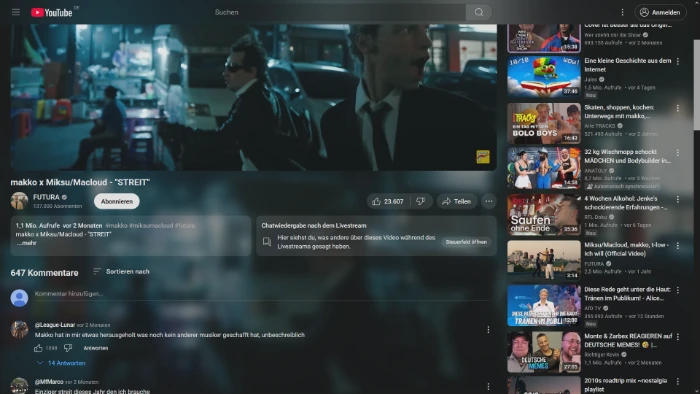

# youtube-better-ambient  
> :warning: WIP

**Enhanced Ambient Mode for YouTube**  
youtube-better-ambient is a browser extension that enhances YouTube’s ambient mode by placing a blurred version of the video in the background and making various UI elements transparent for a more immersive experience.




## Possible Features (Planned / Ideas)
- [ ] Add settings to control blur intensity, opacity, and toggle the extension on/off
- [x] ~~Publish extension on Chrome and Firefox extension stores~~ (Chrome Store requires a refresh token, it is not possible to automate that)
- [x] ~~Use GitHub Actions for automated builds~~
- [ ] Render blur using OpenGL with linear Gaussian blur (via multiple box blurs)
- [x] ~~Automatically disable blur in fullscreen mode to reduce resource usage~~


## Development Setup
```bash
npm ci
npm run dev
```

(Optional for auto reload and seperate firefox)
```bash
npm install --global web-ext
web-ext run
```

## Build
```bash
npm run build
```

